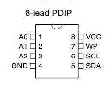
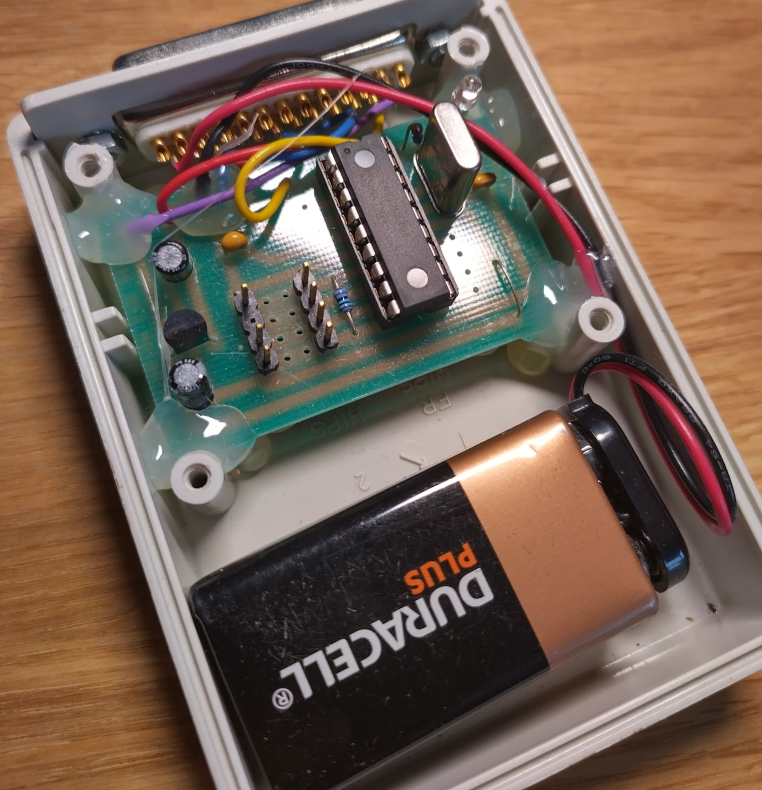
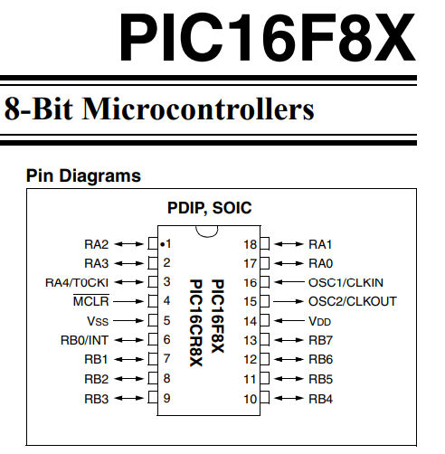

# Reverse Engineering

There's not a huge amount of available data for the trail counter construction.

## Data Cube

The data cubes are the elements used to capture trail count. These are periodically recovered and the data is dumped off them.

They're a resin potted unit making them inconvenient to directly inspect.

### Initial Info

- 8 pins on 2.54 pitch headers.
- 2 rows, pin 7 blanked.

### Investigation

X-Ray shows data cube is a 8-pin DIP with the 2x4p headers soldered directly to the pins.

#### Pinout

?> N.B. Pinout here is from perspective looking at the headers on the cube. [Here for reader perspective](#pinout-cube).

| Pin Number | Function   | Function   | Pin Number |
|:----------:|:----------:|:----------:|:----------:|
| 1          | ?          | ?          | 8          |
| 2          | ?          | **BLANK**  | 7          |
| 3          | ?          | ?          | 6          |
| 4          | ?          | ?          | 5          |

!> p7 & p8 are electrically common

#### Actions

None -> The reader will provide the interfacing data in the first instance 

### Thoughts

*Likely* to be I2C EEPROM or similar.

Based on [reader investigation](#pinout-cube), something along the lines of:

Like [AT24C*](https://ww1.microchip.com/downloads/en/devicedoc/doc0180.pdf), or [25AA*](https://ww1.microchip.com/downloads/aemDocuments/documents/MPD/ProductDocuments/DataSheets/25AA020A-25LC020A-2-Kbit-SPI-Bus-Serial-EEPROM-20001833H.pdf)

---

## Serial Link

UART to USB

### Initial Info

- DB-25 plug to DB-9 socket

### Investigation

- Houses Maxim [MAX3222CPN](https://pdfserv.maximintegrated.com/en/ds/MAX3222-MAX3241.pdf)
  - Level translator 3v0 to 5v5
- DB-25 p14 & p15 shorted

#### Pinout (DB-25 Plug)

| Pin Number | Function   |
|:----------:|:----------:|
| 1          | ? (Green)  |
| ...        |            |
| 14         | Bridge p15 |
| 15         | Bridge p14 |
| ...        |            |
| 19         | ? (Blue)   |
| ...        |            |
| 24         | ? (Yellow) |
| 25         | ? (Red)    |

#### Actions

TBD -> Sniff UART comms between PC and Reader

---

## Reader

Used to extract data from the data cubes.

### Initial Info

- DB-25 socket for interfacing to other equip
- Pin headers for data cube
- Comms is likely via UART.

### Investigation

!> 9V battery in use is production date 09/19, expiry 09/24

- Based on [PIC16F84](https://ww1.microchip.com/downloads/aemDocuments/documents/MCU08/ProductDocuments/DataSheets/30430D.pdf).
  - [PIC16F84-10I/P](https://www.microchipdirect.com/product/PIC16F84-10I%2FP)

- VBAT ~9V is routed from Battery+ to DB-25 p14
  - [serial link investigations](#investigation-1) showed its DB-25 p14 & p15 bridged by solder
    - This bridge is supplying the power back in and reducing battery drain by severing power when not in use.
- Returned VBAT on DB-25 p15 is dropped to 5V using a TO-92 [LM78L](https://www.ti.com/lit/ds/symlink/lm78l.pdf?ts=1709367873785)
    - 5V routed to DB-25 p25 (purple)
- Yellow DB-25 p24 routes to PIC RA2
- Blue DB-25 p19 routes to PIC VSS / 0V

#### Pinout (Cube)

?> N.B. Pinout here is from perspective looking at the headers on the reader. [Here for data cube perspective](#pinout).

?> 10K R between p1 & p4 on cube headers.

| Pin Number | Function   | Function   | Pin Number |
|:----------:|:----------:|:----------:|:----------:|
| 8          | 0V         | PIC RB0    | 1          |
| 7          | **BLANK**  | PIC RB1    | 2          |
| 6          | 0V         | PIC RB2    | 3          |
| 5          | 0V         | PIC RB3    | 4          |

#### Pinout (DB-25 Socket)

| Pin Number | Function   |
|:----------:|:----------:|
| 1          | NC         |
| ...        | NC         |
| 14         | VBAT       |
| 15         | VIN (Red)  |
| ...        | NC         |
| 19         | 0V (Blue)  |
| ...        | NC         |
| 24         | ? (Yellow) |
| 25         | 5V (Purple)|

#### Actions

TBD -> Probe pins for VCC and 0V
TBD -> Identify clock and data lines
TBD -> 
TBD -> Sniff UART comms between PC and Reader

---

## Date Setter

Used for setting epoch on the data cubes at installation time.

### Initial Info

TBD

### Investigation

#### Actions

TBD -> Investigate

---

## Base Station

The base station is buried near the trail in order to conceal the equipment.

### Investigation

#### Actions

TBD -> Probe pins

---

## Pressure Pad

The pressure pad is buried underneath the trail surface. Likely a piezo-electric trigger into the base-station.

### Investigation

#### Actions

TBD -> Probe pins